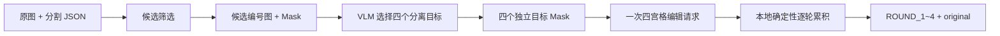

# CascadeForge

> 多目标级联图像编辑数据流水线


CascadeForge 将“候选目标筛选 → 视觉语言模型选择 → 四轮累计编辑 → 结果拆分”封装成一条可复现的 Python 流水线。它面向需要构建多目标图像编辑数据、验证编辑顺序或批量生成四宫格编辑结果的计算机视觉实验。

**GitHub 简介：** 基于自动分割与视觉语言模型的多目标级联图像编辑、掩码生成和数据构建流水线。

## 核心能力

- 从 SA-1B 风格 JSON 中解码 COCO RLE，并按面积、质量、边界和重叠度筛选候选目标。
- 使用视觉语言模型选择四个彼此分离的实体，并生成四轮独立目标编辑提示词。
- 为四个象限分别生成单目标 Mask，再由本地程序按轮次确定性累积编辑结果。
- 支持 OpenAI-compatible 视觉模型、图像编辑 API 和可选 OSS 图片暂存；凭据只从环境变量或本地配置读取。
- 对元数据、路径、下载 URL 和发布样例提供显式脱敏边界，避免将本地数据或密钥带入 Git。

## 数据流



## 快速开始

```powershell
python -m venv .venv
.\.venv\Scripts\Activate.ps1
pip install -e ".[dev]"
Copy-Item .env.example .env
```

将原图与同名 JSON 放进本地 `100_CUT/`（该目录默认被 Git 忽略），然后按顺序执行：

```powershell
cascadeforge preprocess --input 100_CUT --output IMAGE_MASK
cascadeforge select --input IMAGE_MASK --config config.local.json
cascadeforge edit --input IMAGE_MASK --config config.local.json
cascadeforge organize --input IMAGE_MASK/EDITED_4K --source IMAGE_MASK/IMAGE_2 --output OUTPUT/AC_multi_object
```

没有安装为包时，也可以使用兼容入口：

```powershell
python preprocess_ac.py
python process_vl_ac.py
python batch_edit_ac.py
python organize_results_ac.py
```

## 配置

复制 `config.example.json` 为本地的 `config.local.json`，或设置 `.env` 中的环境变量。环境变量优先级高于本地 JSON；真实配置文件已被 `.gitignore` 排除。

| 能力 | 关键变量 | 用途 |
| --- | --- | --- |
| 视觉选择 | `GPT_API_KEY`、`GPT_BASE_URL`、`GPT_MODEL` | 选择四个分离目标并生成四轮局部编辑提示词 |
| 图像编辑 | `TOAPIS_API_KEY`、`TOAPIS_API_URL` | 提交四宫格累计编辑任务 |
| 图片暂存 | `OSS_ACCESS_KEY_ID`、`OSS_ACCESS_KEY_SECRET` | 编辑 API 无法直接读取本地文件时上传图片 |

## 输出结构

```text
IMAGE_MASK/
├── IMAGE_2/          标准化原图
├── IMAGE_2X4/        四宫格输入图
├── CANDIDATES/       候选编号图、候选 Mask 和元数据
├── JSON/             四轮编辑提示词
├── MASK/             四个独立目标组成的四宫格透明 Mask
├── OBJECT/           四个选中目标的预览
├── SELECTION/        目标选择记录
└── EDITED_4K/        本地确定性累积后的四宫格结果

OUTPUT/AC_multi_object/{digest}/
├── original.jpg
├── ROUND_1.jpg
├── ROUND_2.jpg
├── ROUND_3.jpg
└── ROUND_4.jpg
```

## 脱敏与发布边界

- `API_KEY/`、`.env`、签名 URL、OSS 凭据、下载 JSON、原始数据和中间产物不进入仓库。
- 预处理元数据只保存文件名，不保存本机绝对路径。
- 发布样例应使用 `sample_001` 等中性名称，清除 EXIF/GPS，并检查人脸、工牌、车牌、联系方式和品牌标识。
- 当前仓库只展示原创流程横幅，不提交本地真实图片；完整数据请按自己的授权范围放到被忽略的本地目录。
- 图片数据的版权/再分发许可不由 Apache-2.0 代码许可证自动覆盖，使用者必须自行确认数据来源授权。

## 开发与测试

```powershell
python -m compileall cascadeforge
python -m cascadeforge --help
pytest
```

外部 API 不配置凭据时，预处理、候选筛选、Mask 校验和结果拆分仍可独立测试；编辑传输层通过 mock 覆盖上传、轮询、重试和下载逻辑。

## 许可证

代码采用 [Apache License 2.0](LICENSE)。第三方数据、模型、API 和图片资产仍受其各自许可证与服务条款约束。
